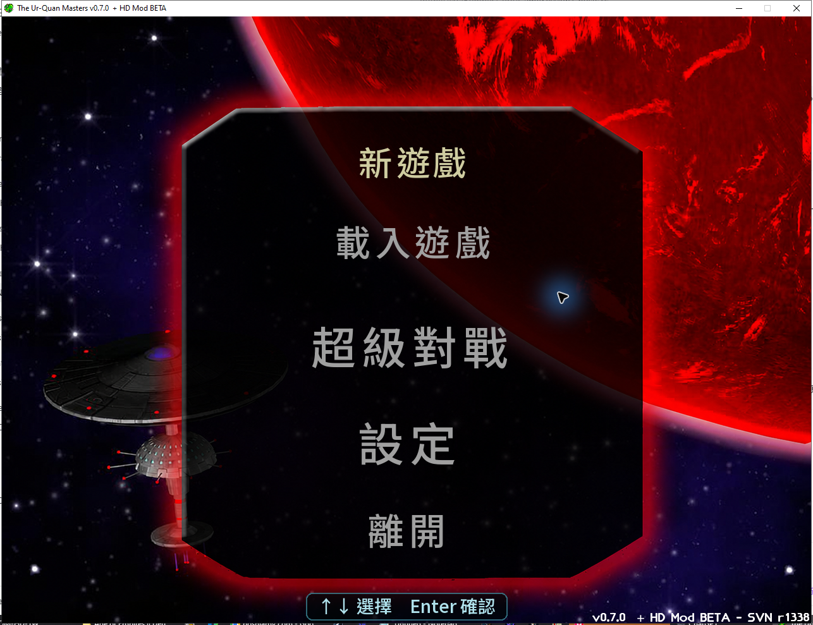
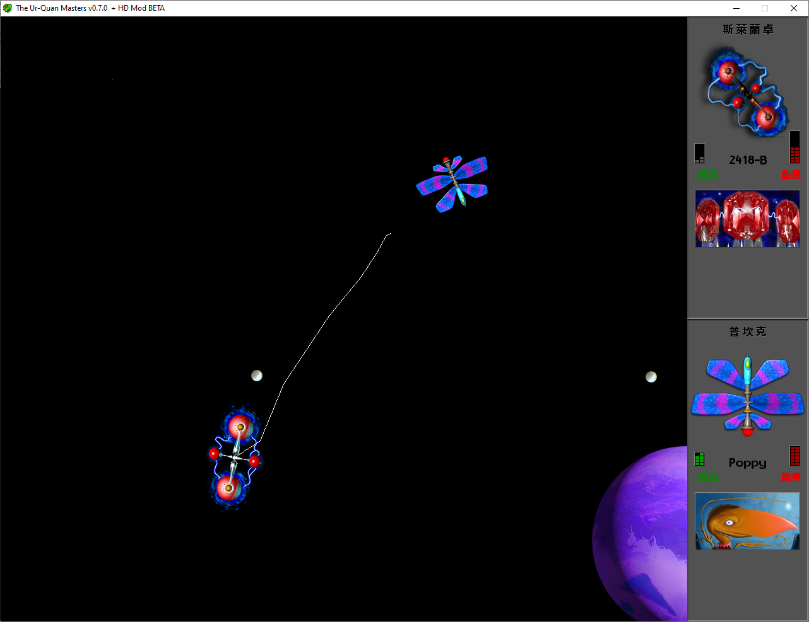
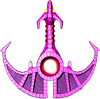
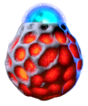
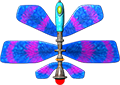
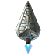
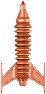
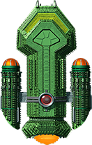
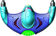

# The Ur-Quan Masters HD 繁體中文版

這是《The Ur-Quan Masters HD Beta 1》的非官方繁體中文版本、可重現的本地化工具鏈，以及相應的 Windows 安裝與驗證程式。翻譯由 OpenAI Codex 語言模型重新完成，再經格式契約、字型生成、封裝測試與實機視覺檢查；目前仍未經完整母語人工校訂及全流程通關。

> 本專案包含多種授權。程式碼主要採 GPL-2.0-or-later；遊戲文字、翻譯、圖像與音訊衍生內容採 CC BY-NC-SA 2.5，**不得作商業用途**；文件採 CC BY 2.0。詳見[授權與致謝](#授權與致謝)。

## 版本特色

- 涵蓋 107 份資源文件中的全部 5,177 筆可翻譯記錄，包括劇情對話、字幕、選單、船艦名稱及結局。
- 主選單已本地化為「新遊戲、載入遊戲、超級對戰、設定、離開」。
- Super Melee 隊伍設定畫面的標題、玩家／電腦難度、連線、儲存、載入、
  開戰及離開按鈕均已本地化；控制框保留原版角色與選取光效。
- 選取項目使用持續可辨識的黃色脈衝，不再與未選取項目或原版暗紅色混淆。
- 使用 Noto Sans TC 產生可重現的點陣字型；主選單採 Medium/500，一般小字採
  Bold/700，戰鬥狀態標籤則依解析度改用較輕的 450／400／350 字重。
- 太陽、日期／月份、船長、船名、燃料及船員等 SIS 欄位使用符合固定 HUD
  高度的字格，不再裁掉中文字形的頂部或與相鄰欄位重疊。
- `船員`、`能量`（原 CREW、BATT）及星圖快捷鍵說明均已本地化；戰鬥
  狀態字依解析度使用獨立光學尺寸與較輕字重，並保留原版灰色狀態面板，
  不再糊成厚重色塊或出現黑底。
- Super Melee 編組時的「選擇船艦／船艦資料」面板及 Project 6014 提示已繁中化；
  英文縮寫欄位會重用完整中文船名，不再把名稱末字顯示成句點。
- 25 艘 Super Melee 船艦均有完整繁中資料頁，分別以原生 320×240、640×480
  及 1280×960 產生；內容涵蓋船員、能量、費用、機動數值、武器、特殊能力及戰法。
- 修正 HD Beta 1 開始新遊戲後可能停在黑畫面的資源封裝問題。
- 本機 Super Melee 中按 `Esc` 可結束目前一局並返回隊伍設定；玩家的特殊能力鍵不會誤觸此功能。
- 玩家一的特殊能力除了右 `Shift` 與數字鍵盤 `0`，亦可使用右 `Alt`；原有按鍵仍然保留。
- 主選單、Super Melee 隊伍設定、船艦編組與開戰前選船均支援滑鼠；游標停在船艦上會更新目前船艦資料。移動滑鼠會顯示游標，按鍵或按下滑鼠鍵會隱藏游標。
- Super Melee 開戰前的選船畫面會顯示目前船艦的船員、能量、費用、極速、加速、轉向、回能與動作消耗；`Esc` 與紅色 `X` 共用確認返回流程。
- 建議以 4x 高解析度全螢幕模式遊玩繁體中文。

<p align="center">
  
</p>

<p align="center"><em>4x 主選單實機畫面；黃色項目是目前選取項目。</em></p>

<p align="center">
  
</p>

<p align="center"><em>4x Super Melee 實機畫面；標題與右側控制、儲存、載入、開戰及離開項目均為繁中。</em></p>

<p align="center">
  
</p>

<p align="center"><em>4x Super Melee 實戰畫面；Slylandro 與 Pkunk 對戰，雙方 HUD 均顯示繁中的「船員／能量」。</em></p>

## 下載、建置與安裝

### 已建置套件

大型 `.uqm` 套件與 Windows 執行環境不放入 Git 歷史；請前往
[GitHub Releases](https://github.com/blhsing/uqm-hd-traditional-chinese/releases/latest)。
v0.3.2 壓縮檔包含三個繁中套件、管理式安裝器、驗證工具、
`runtime/windows-x86`（EXE、DLL、manifest 與授權文件），但**不包含原版遊戲的
`content`／音樂／語音／圖像**；安裝時仍須提供合法取得的 UQM-HD Beta 1 內容。

本版本的三個套件必須一起安裝：

| 檔案 | 位元組 | SHA-256 |
|---|---:|---|
| `zh_TW.uqm` | 22,455,949 | `1a1b2bd13d6c8e1a8475c16a15c706602d62b7cab1a20fe395c9b931aa707942` |
| `hires2x-zh_TW.uqm` | 42,596,373 | `edef271c9034827bfab29e37c1d37b568ecc779285adc6b5d7730abd5cb1f098` |
| `hires4x-zh_TW.uqm` | 64,579,231 | `03f8491bdf5e84251a305dd73d52e353ac66efee717a9b336f3d152dc38c5749` |

v0.3.2 推薦使用由本儲存庫原始碼建置的 Windows x86 執行環境：

| 檔案 | 位元組 | SHA-256 |
|---|---:|---|
| `runtime/windows-x86/uqm-hd.exe` | 3,022,388 | `6f33a1b73a38ce5e4a7045a67a5f520eaaa15a8c16eaa8f169d0cff5ecc2364f` |
| `runtime/windows-x86/runtime-manifest.json` | 27,388 | `478bfc840a080977ca65fa366502b04d57d4e473405a93504e7c4c0a5bd58f5c` |

完整 `uqm-hd-zh-tw-v0.3.2.zip` 為 142,529,938 bytes，SHA-256：
`b85413cc1d4fc7a5743042f4c41ab4bbb0b1ca6c1e4d636cd83662d1ab6be60d`。

manifest 驗證 20 個 PE32/i386 payload、27 份授權檔及完整 import graph，未解析的
非系統相依項為 0。執行檔來自乾淨的 `game/` 樹（1,043 個檔案），來源 commit 為
`7981479c611b60af041d05ec01a40791eb993f51`。舊版官方 EXE 的四階段雜湊鎖定
PE 修補器仍保留作相容性備援；它會驗證完整輸入雜湊、唯一指令特徵、固定檔案位移及
PE checksum，遇到未知版本即拒絕修改。

### 自行重建繁中套件

需求：

- Python 3.10 以上；自行重建套件另需 `Pillow`。
- 從 [UQM-HD SourceForge 專案](https://sourceforge.net/projects/urquanmastershd/)取得並解壓縮的 Beta 1 `content` 目錄。
- `NotoSansTC-VF.ttf`；Windows 安裝 Noto Sans TC 後通常位於 `C:\Windows\Fonts`。

```powershell
python -m pip install -r .\tools\localization\requirements.txt

python .\tools\localization\uqm_localize.py validate `
  --workspace .\localization\workspace.zh-TW.final

python .\tools\localization\uqm_localize.py build `
  --content-root C:\path\to\UQM-HD\content `
  --workspace .\localization\workspace.zh-TW.final `
  --output .\localized-build `
  --font C:\Windows\Fonts\NotoSansTC-VF.ttf `
  --menu-background .\localization\menu-assets\source\newgame4x-clean-imagegen.png
```

如要從 `game/` 重建及稽核 Windows PE32 執行環境，請依
[Windows x86 執行環境建置文件](docs/BUILD-WINDOWS.md)使用鎖定的可攜式 MSYS2
工具鏈；正式命令會拒絕 dirty `game/`、套件版本漂移、未解析 DLL 或缺少授權文字。

### Windows 管理式安裝

先用 `-PlanOnly` 演練；確認輸入後再移除該參數正式安裝。推薦傳入發行包的
`runtime/windows-x86`：安裝器會驗證 manifest、每個 EXE／DLL 的大小與 SHA-256、
安裝路徑及授權來源，再把 `uqm-hd.exe` 安裝為受管理的 `uqm.exe`。這條路徑不需
Python，也不會對 EXE 套用二進位補丁。

```powershell
powershell.exe -NoProfile -ExecutionPolicy Bypass `
  -File .\tools\install\Install-UqmHdZhTw.ps1 `
  -SourceRoot C:\path\to\UQM-HD `
  -PacksDir .\packages `
  -RuntimeDir .\runtime\windows-x86 `
  -InstallRoot C:\Games\UQM-HD-TW `
  -ProfileDir "$env:APPDATA\UQM-HD-zh_TW" `
  -PlanOnly
```

使用自訂 runtime 時，`SourceRoot` 只需提供原版 `content` 與 `content\addons`；
來源根目錄的 EXE／DLL 不會複製進安裝。安裝器會建立隔離的設定／存檔目錄、
桌面與開始選單全螢幕捷徑，以及 1x、2x、4x 視窗模式捷徑。更新時只會移除上一次
由本安裝器管理、且長度與 SHA-256 仍完全相符的舊檔；使用者修改過的管理檔會令
安裝停止，無關檔案不會被鏡像刪除。進行中的交易使用獨立 `.installing` marker，
直到新安裝完整成功才取代上一份 complete marker。

### 推薦全螢幕模式

此主機驗證過的 1920×1080 範例：

```powershell
uqm.exe -o -r 1920x1080 -f -k -c none --resfactor=2 `
  -C "$env:APPDATA\UQM-HD-zh_TW" --addon hires4x-zh_TW
```

其他螢幕可更換 `-r` 的解析度，但建議保留 `--resfactor=2`、`--addon hires4x-zh_TW` 與最近鄰縮放 `-c none`。遊戲邏輯畫面是 4:3；寬螢幕左右出現黑邊是正常的比例保護。遊戲中亦可按 `F11` 切換全螢幕。

## 完整玩法指南

### 遊戲目標

《The Ur-Quan Masters》結合太空探索、即時戰鬥、資源管理及外交劇情。你率領一艘以先驅者科技建造、可自由更換模組的旗艦返回太陽系，卻發現地球已被烏爾關封鎖，附近星際基地也瀕臨斷電。

低劇透的長期目標是恢復地球星際基地、探索銀河、蒐集資源與情報、尋找盟友，並建立足以挑戰烏爾關的艦隊。部分銀河事件會隨日期推進；不必倉促作戰，但也不要在超空間中毫無目的地消耗時間與燃料。

### 主選單

| 選項 | 功能 |
|---|---|
| **新遊戲** | 從故事開頭開始，設定艦長、旗艦及新聯盟名稱。 |
| **載入遊戲** | 從劇情模式存檔繼續。 |
| **超級對戰** | 編組兩支艦隊直接交戰，適合練習船艦。 |
| **設定** | 調整畫面、音訊、控制鍵及 PC／3DO 風格。 |
| **離開** | 結束遊戲。 |

### 預設鍵盤操作

所有按鍵均可在設定中檢視或更改。

| 類別 | 動作 | 預設按鍵 |
|---|---|---|
| 選單 | 移動 | 方向鍵或數字鍵盤 `8/2/4/6` |
| 選單 | 確認 | `Enter`、右 `Ctrl`、數字鍵盤 `Enter` |
| 選單 | 取消／指令選單 | `Space`、右 `Shift`、`Esc`、數字鍵盤 `0` |
| 系統 | 暫停 | `Pause` 或 `F1` |
| 系統 | 切換全螢幕 | `F11` |
| 航行／戰鬥 | 推進 | `↑` 或數字鍵盤 `8` |
| 航行／戰鬥 | 左／右轉 | `←`／`→` 或數字鍵盤 `4`／`6` |
| 戰鬥 | 主要武器 | 右 `Ctrl` 或 `Enter` |
| 戰鬥 | 特殊能力 | 右 `Shift`、右 `Alt` 或數字鍵盤 `0` |
| 劇情戰鬥 | 允許時緊急脫離 | `Esc` |
| 本機 Super Melee | 結束目前一局 | **只有 `Esc`** |

其他戰鬥配置包括 WASD（`W/S/A/D` 加 `V/B`）、Arrows (2)（方向鍵、`]`、`[`）及 ESDF（`E/D/S/F` 加 `Q/A`）。遊戲沒有通用倒車鍵；放開推進後仍保留慣性，必須轉向反推。Supox 的平移是其專用特殊能力，不代表其他船艦可按向下鍵倒車。

#### 玩家二的 Super Melee 操作

本版本預設由玩家二控制 Super Melee 畫面**上方隊伍**，並使用 `ESDF` 控制配置。開始前先把上方控制框設為「玩家操控」；開戰後，兩位玩家各自使用自己的按鍵選船及控制船艦。

| 階段／動作 | 玩家二按鍵 |
|---|---|
| 選船：上／下／左／右 | `E`／`D`／`S`／`F` |
| 選船：確認 | `Q` |
| 戰鬥：推進 | `E` |
| 戰鬥：左轉／右轉 | `S`／`F` |
| 戰鬥：主要武器 | `Q` |
| 戰鬥：特殊能力 | `A` |

`D` 只在選船畫面用來向下移動；戰鬥中沒有通用倒車功能。繁中版本中，`Esc` 可結束目前一局並返回隊伍設定畫面。

若要更改按鍵，請從主選單進入「設定」→「設定控制鍵」：

1. 在「玩家二」選擇要使用的「控制配置」。
2. 若要修改配置本身，選擇「編輯控制鍵」。
3. 選定控制配置後，在「上／下／左／右／武器／特殊能力／離開」項目按 `Enter`，再按下新按鍵。
4. 按 `Delete` 可移除目前綁定；返回並離開設定選單後會儲存變更。

星圖常用鍵：

| 動作 | 按鍵 |
|---|---|
| 移動游標 | 方向鍵 |
| 設定自動導航 | `Enter` 或右 `Ctrl` |
| 縮放 | `Page Up`／`Page Down`、`+`／`-` |
| 搜尋恆星 | `F6` 或 `/` |
| 切換舊式星圖資料 | `F7` |
| 關閉星圖 | `Space`、右 `Shift` 或 `Esc` |

對話中可用 `↑/↓` 選回應、`Enter` 確認、`→` 快轉、`←` 重播；取消鍵可跳過目前語音或開啟對話摘要。座標、期限及種族名稱經常藏在對話裡，建議保留字幕並自行記錄。

登陸艇以 `↑` 前進、`←/→` 轉向、右 `Ctrl` 或 `Enter` 射擊；右 `Shift`、數字鍵盤 `0` 或 `Esc` 返回旗艦。登陸艇會自動拾取接觸到的物件；被摧毀時會失去登陸艇、艇員及尚未送回旗艦的貨物。

### 太陽系、超空間與星圖

在行星系內靠近行星或衛星即可進入近軌道；朝恆星系外緣航行會進入超空間。取消鍵會打開旗艦指令選單，常用項目包括掃描、星圖、裝置、貨艙、艦載清單、遊戲及導航。

超空間移動會持續消耗燃料。選取星圖上的恆星可設定自動導航並顯示預估需求；返回超空間後旗艦會自行前往，手動轉向或推進則取消導航。出發時要保留返航或繞道燃料。早期增加推進器及姿態噴射器，通常比立即把旗艦改成笨重砲臺更重要。

### 掃描、登陸與礦物

軌道資料會顯示溫度、天候、地殼活動、重力及大氣。高溫、高天候及高地殼活動會危及登陸艇；重力越高，派遣所需燃料越多。氣態巨行星及受到護盾保護的世界無法登陸。一次登陸最多消耗 3 單位燃料。

| 掃描 | 用途 |
|---|---|
| 礦物掃描 | 找出可帶回星際基地兌換 RU 的礦藏。 |
| 能量掃描 | 找出遺跡、裝置或任務相關訊號。 |
| 生物掃描 | 找出生命形態；通常需以登陸艇武器制伏後回收。 |

礦物每單位基礎價值：

| 類別 | RU | 類別 | RU |
|---|---:|---|---:|
| 常見 | 1 | 腐蝕性 | 2 |
| 卑金屬 | 3 | 稀有氣體 | 4 |
| 稀土 | 5 | 貴重 | 6 |
| 放射性 | 8 | 異質 | 25 |

危險世界上的少量普通礦物通常不值得冒險。早期優先處理低溫、低天候、低地殼活動且礦藏密集的行星；取得登陸艇防護後再回頭探索高風險世界。

### RU、燃料、船員與旗艦模組

RU 可購買燃料與船員、建造旗艦模組及護航艦。主要來源是礦物及戰後殘骸。此 HD 版本在基地購買一單位燃料的基礎成本是 20 RU；大量傷亡也會提高招募成本。

旗艦有 11 個推進器位置、8 個姿態噴射器位置及 16 個主要模組槽。

| 模組 | 功能 |
|---|---|
| 行星登陸艇 | 派員前往行星表面。 |
| 聚變推進器 | 提高速度與加速。 |
| 姿態噴射器 | 提高轉向速度。 |
| 船員艙 | 每座最多增加 50 名船員容量。 |
| 儲藏艙 | 每座增加 500 單位礦物容量。 |
| 燃料槽 | 每座增加 50 單位燃料容量。 |
| 發電機 | 加快戰鬥能量恢復。 |
| 離子脈衝砲 | 旗艦武器，射向依安裝槽位而定。 |

實用的早期順序是先裝約 5–6 具推進器、增加數具姿態噴射器、保留 1–2 座儲藏艙、攜帶足夠往返燃料，再逐步增加發電機、船員艙與武器。

### 戰鬥

`船員` 相當於船艦耐久度，降至零即被摧毀；`能量` 供武器及特殊能力使用。不要無腦按住射擊：很多船艦必須保留能量給護盾、變形、傳送或致命的一輪攻擊。

- 戰場邊緣彼此相連，飛出一側會從另一側出現。
- 行星重力可用於急轉或彈弓加速；撞上行星會受傷。
- 相剋關係往往比船艦費用更重要；飛彈、雷射、點防禦、速度與船員數各有優勢。
- 劇情中可先派護航艦消耗敵人；旗艦被摧毀的後果遠大於失去一般護航艦。
- 情勢不利時可嘗試 `Esc` 緊急脫離，但劇情條件不一定允許。

### 外交、情報與 Melnorme

遊戲沒有現代式完整任務追蹤器。線索來自外星種族對話、地球基地通報、能量掃描、星圖勢力範圍及取得的特殊裝置。第一次遇到陌生種族時先交談，記下恆星名稱、座標與期限；完成任務後返回地球基地詢問進度。

生物資料不在地球基地換成 RU。Melnorme 商人會以信用點數收購生物資料，再出售燃料、情報及技術。登陸艇的防熱、防震、防雷、速度與容量等重要升級多由此取得。

### 儲存與新手路線

劇情模式有 50 個存檔欄位。建議輪替保留「安全返航、重大外交前、危險登陸前、遠航出發、目前進度」等多個存檔。此版本的獨立資料位於 `%APPDATA%\UQM-HD-zh_TW`；重新安裝前可備份整個目錄。

低劇透的新手流程：

1. 聽完太陽系星際基地的求救訊息。
2. 調查月球附近的情況。
3. 掃描水星並取得基地需要的放射性物質；取得足夠物資便離開危險表面。
4. 返回地球基地完成啟用流程。
5. 購買推進器、姿態噴射器、燃料及基本儲藏空間。
6. 探索太陽附近的安全恆星系，累積第一批 RU。
7. 用 Super Melee 熟悉船艦，再開始更遠的外交與探索。
8. 收集生物資料，尋找 Melnorme 升級登陸艇。
9. 每次遠航預留返航燃料，出發前另存一檔。

## Super Melee

每隊最多 14 艘船；可載入、儲存隊伍並選擇人類或電腦控制。每艘船有不同費用，讓兩隊總值接近即可進行較公平的練習。

滑鼠可直接選擇右側按鈕、兩隊的 14 個欄位及 5×5 船艦清單；停在船艦上即可預覽船艦狀態。開戰前選船畫面另會顯示目前船艦的基本性能與能量資料。游標移動時顯示，按下鍵盤鍵或滑鼠鍵時隱藏，以免戰鬥中遮擋畫面。

編組時開啟 5×5「選擇船艦」面板、把游標移到任一船艦，再按左 `Alt`、右
`Alt` 或點擊 `船艦資料`，即可開啟該船艦的全螢幕資料頁；按 `Enter`／`Esc`，
或在資料頁可視範圍內任意位置按一下滑鼠左鍵，即可返回選船面板。點擊
`選擇船艦` 則與按 `Enter` 相同，會確認目前船艦。

在開戰前選船畫面按 `Esc`，會呼叫與紅色 `X` 相同的確認視窗；確認後回到隊伍設定。在**本機** Super Melee 戰鬥中按 `Esc` 會結束目前一局。這兩條路徑都只接受實體 `Escape`，所以右 `Shift`、右 `Alt` 與數字鍵盤 `0` 仍可正常發動玩家一的特殊能力。劇情模式的原版逃跑規則不變。

網路 Super Melee 尚未驗證，也沒有為這項本機輸入新增網路同步；請勿假定遠端對戰具有相同行為。

## 船艦圖鑑

Sa-Matra 與 Ur-Quan Security Drone 不是可選船艦，因此不列入圖鑑。下表以單一、永遠展開的表格收錄 25 艘 Super Melee 船艦；每一列先列繁體中文名稱及英文名稱，再顯示船艦圖片。船員、能量、費用、極速、推進、加速時間、轉向、回能、武器與特殊能力資源等數值各有獨立欄位，不使用合併式數值縮寫。初始值與上限相同時只顯示一次；只有 Syreen 船員數及 Utwig 能量值會分別列出初始值與上限。戰役專用的先驅者旗艦另於表格下方介紹。

「極速」及每次推進增加的速度單位都是引擎內部基準值，不是螢幕像素／秒。戰鬥邏輯以每秒 24 個戰鬥幀運作。由靜止加速至極速及完成 360 度轉向的時間是理想推算值，假設持續按鍵且不受重力、碰撞、後座力或敵方效果干擾；實戰結果可能不同。變形、後燃器等能力造成的性能變化已在對應欄位明確標示；重力彈弓、武器後座力及特殊能力仍可能使實際速度超出一般極速。除非另有說明，武器與特殊能力的能量數字均指每次使用的消耗。

| 船艦名稱與圖片 | 船員數 | 能量值 | 超級對戰編隊費用 | 極速（引擎基準值） | 推進／加速度 | 加速至極速 | 完成 360 度轉向 | 自然能量恢復 | 主武器能量消耗 | 特殊能力能量規則 | 特殊能力其他資源規則 | 武器 | 特殊能力 | 策略、優勢與弱點 |
|---|---|---|---|---|---|---|---|---|---|---|---|---|---|---|
| <strong>安德羅辛斯・守護艦</strong><br><em>Androsynth Guardian</em><br> | 20 | 24 | 15 | <strong>一般：</strong>24<br><strong>Blazer 彗星形態：</strong>60 | 每 1 個戰鬥幀增加 3 個速度單位 | 0.33 秒 | <strong>一般形態：</strong>3.33 秒<br><strong>Blazer 彗星形態：</strong>1.33 秒 | 每 9 個戰鬥幀恢復 1 | 每次 3 | 啟動 Blazer 彗星形態至少需要 2；維持期間每 9 個戰鬥幀消耗 1 | — | 耐久、長壽命的追蹤酸泡泡。 | 變成高速 Blazer 彗星，以衝撞造成傷害；撞擊本身不扣自身生命，但並非對所有武器無敵。 | 先用泡泡封鎖空間，再變形追擊。爆發機動極強，但能量耗盡會強制復原，衝撞路線也較可預測。 |
| <strong>阿里盧拉萊萊・小艇</strong><br><em>Ariloulaleelay Skiff</em><br> | 6 | 20 | 16 | 40 | 每 1 個戰鬥幀增加 40 個速度單位 | 0.04 秒 | 0.67 秒 | 每 7 個戰鬥幀恢復 1 | 每次 2 | 每次瞬移消耗 3 | — | 近距離自動瞄準雷射。 | 隨機瞬移。 | 無慣性、可立即改向，適合貼身繞背；只有 6 名船員且射程短，瞬移落點也不可控。 |
| <strong>陳傑蘇・育巢艦</strong><br><em>Chenjesu Broodhome</em><br> | 36 | 30 | 28 | 27 | 每 5 個戰鬥幀增加 3 個速度單位 | 1.88 秒 | 4.67 秒 | 每 5 個戰鬥幀恢復 1 | 每次 5 | 每次放出 DOGI 干擾衛星消耗 30 | — | 高傷害水晶；放開射擊鍵可手動炸成碎片。 | 放出 DOGI 干擾衛星，撞擊時推開敵艦並抽走最多 10 能量。 | 重型區域控制艦，單發威力高但加速、轉向慢；DOGI 干擾衛星可被擊毀，召喚也需完整能量槽。 |
| <strong>克姆爾混合種・化身艦</strong><br><em>Chmmr Avatar</em><br> | 42 | 42 | 30 | 35 | 每 6 個戰鬥幀增加 7 個速度單位 | 1.25 秒 | 2.67 秒 | 每 2 個戰鬥幀恢復 1 | 每次 2 | 牽引光束每次消耗 1 | — | 近距離連續雷射；三枚 ZapSat 護航衛星會自動攔截彈體並攻擊近敵。 | 牽引光束。 | 把敵人拉入雷射及衛星殺傷圈。近戰壓制頂尖，但體型大、轉向慢，衛星被擊毀後防護會降低。 |
| <strong>德魯吉・重擊艦</strong><br><em>Druuge Mauler</em><br> | 14 | 32 | 17 | 20 | 每 2 個戰鬥幀增加 2 個速度單位 | 0.83 秒 | 3.33 秒 | 每 51 個戰鬥幀恢復 1 | 每次 4 | — | 犧牲 1 名船員，回復 16 能量 | 超長射程、造成 6 傷害且後座力極高的炮彈。 | 犧牲 1 名船員換取 16 能量。 | 利用炮擊後座力移動並遠距狙擊。火力優異，但自然能量恢復極慢，失誤會同時消耗能量與船員。 |
| <strong>地球人・巡洋艦</strong><br><em>Earthling Cruiser</em><br> | 18 | 18 | 11 | 24 | 每 5 個戰鬥幀增加 3 個速度單位 | 1.67 秒 | 1.33 秒 | 每 9 個戰鬥幀恢復 1 | 每次 9 | 每次點防禦消耗 4 | — | 長距離追蹤核彈。 | 近距離點防禦雷射。 | 遠距離發射核彈並攔截威脅；便宜、容易上手，但核彈可被擊落，近戰及能量恢復較弱。 |
| <strong>伊爾拉斯・復仇艦</strong><br><em>Ilwrath Avenger</em><br> | 22 | 16 | 10 | 25 | 每 1 個戰鬥幀增加 5 個速度單位 | 0.21 秒 | 2.00 秒 | 每 5 個戰鬥幀恢復 4 | 每次 1 | 每次進入隱形消耗 3 | — | 船首短距離火焰。 | 隱形；隱形中開火會解除隱形並自動朝向敵艦。 | 隱形接近後貼身噴火，近距離輸出高；缺乏遠程手段，對手仍可從畫面與聲音推測位置。 |
| <strong>克爾阿・掠奪艦</strong><br><em>Kohr-Ah Marauder</em><br> | 42 | 42 | 30 | 30 | 每 7 個戰鬥幀增加 6 個速度單位 | 1.46 秒 | 3.33 秒 | 每 5 個戰鬥幀恢復 1 | 每次 6 | 每次環形火焰氣雲消耗 21 | — | 最多部署 8 枚耐久旋鋸；放開射擊後減速，接近敵艦時重新追蹤。 | 向 16 個方向爆出火焰氣雲。 | 擅長布置雷區與近身清場；船體笨重，環形爆發會消耗一半能量。 |
| <strong>梅爾諾姆・商旅艦</strong><br><em>Melnorme Trader</em><br> | 20 | 42 | 18 | 36 | 每 5 個戰鬥幀增加 6 個速度單位 | 1.25 秒 | 3.33 秒 | 每 5 個戰鬥幀恢復 1 | 每次 5 | 每次混亂射線消耗 20 | — | 可蓄力四級的能量彈；四級傷害依序為 2、4、8、16。 | 混亂射線迫使敵艦轉向並暫時封鎖特殊動作。 | 先以混亂射線控制，再用滿蓄力彈收尾；蓄力需要時間，射線亦會消耗 20 能量。 |
| <strong>姆爾恩姆赫姆・變形艦</strong><br><em>Mmrnmhrm X-Form</em><br> | 20 | 10 | 19 | <strong>飛碟形態：</strong>20<br><strong>火箭形態：</strong>50 | <strong>飛碟形態：</strong>每 2 個戰鬥幀增加 5 個速度單位<br><strong>火箭形態：</strong>每 1 個戰鬥幀增加 10 個速度單位 | <strong>飛碟形態：</strong>0.33 秒<br><strong>火箭形態：</strong>0.21 秒 | <strong>飛碟形態：</strong>2.00 秒<br><strong>火箭形態：</strong>10.00 秒 | <strong>飛碟形態：</strong>每 7 個戰鬥幀恢復 2<br><strong>火箭形態：</strong>每 7 個戰鬥幀恢復 1 | 每次 1 | 每次變形消耗 10 | — | 飛碟形態使用雙雷射；火箭形態使用追蹤飛彈。 | 在飛碟與高速火箭形態之間切換。 | 依對手在靈活近戰及高速遠攻之間切換；變形需要完整能量，兩種形態各有明顯短板。 |
| <strong>邁康・孢子艦</strong><br><em>Mycon Podship</em><br> | 20 | 40 | 21 | 27 | 每 7 個戰鬥幀增加 9 個速度單位 | 0.88 秒 | 4.67 秒 | 每 5 個戰鬥幀恢復 1 | 每次 20 | 每次船員再生消耗 40 | — | 追蹤等離子體，威力隨飛行時間衰減。 | 耗盡 40 能量，恢復最多 4 名船員。 | 適合遠距消耗及長局續戰；船體遲鈍，等離子體可被攔截且遠距命中時傷害較低。 |
| <strong>奧茲・復仇女神艦</strong><br><em>Orz Nemesis</em><br> | 16 | 20 | 23 | 35 | 每 1 個戰鬥幀增加 5 個速度單位 | 0.29 秒 | 1.33 秒 | 每 7 個戰鬥幀恢復 1 | 每次 6 | <strong>炮塔控制：</strong>0 | <strong>太空陸戰隊：</strong>每隊暫時占用 1 名本艦船員 | 可獨立旋轉的炮塔；按住特殊能力鍵再按左右方向鍵可轉動炮塔。 | 按住特殊能力鍵再按射擊鍵可派出太空陸戰隊；每隊暫時占用 1 名船員。 | 可一邊航行一邊向不同方向射擊，陸戰隊直接削減敵船員；過度部署會掏空本艦船員。 |
| <strong>普坎克・狂怒艦</strong><br><em>Pkunk Fury</em><br> | 8 | 12 | 20 | 64 | 每 1 個戰鬥幀增加 16 個速度單位 | 0.17 秒 | 0.67 秒 | 沒有 | 每次 1 | 每次辱罵回復 2 | — | 同時向前、左、右三向射擊。 | 辱罵可回復 2 能量；被摧毀時有 50% 機率以滿狀態復活。 | 速度與轉向極佳，容易繞側面；船員少、單發傷害低，復活完全依賴機率。 |
| <strong>索菲克斯提・偵察艦</strong><br><em>Shofixti Scout</em><br> | 6 | 4 | 5 | 35 | 每 1 個戰鬥幀增加 5 個速度單位 | 0.29 秒 | 1.33 秒 | 每 10 個戰鬥幀恢復 1 | 每次 1 | <strong>榮光自爆裝置：</strong>0 | — | 威力較弱的正面炮。 | 連續觸發可啟動 Glory Device（榮光自爆裝置），對近敵造成巨量傷害。 | 低費用交換型船艦，常用來重創昂貴大船；常規戰力弱，自爆成功仍會失去本艦。 |
| <strong>斯萊蘭卓・探測器</strong><br><em>Slylandro Probe</em><br> | 12 | 20 | 17 | <strong>固定：</strong>60 | 瞬時維持固定高速，無法停船 | 不適用，因為船艦永遠維持固定高速 | 0.67 秒 | 沒有 | 每次 2 | <strong>立即反轉：</strong>0 | <strong>小行星充能：</strong>吸收完整小行星後補滿能量 | 近距離追蹤閃電。 | 吸收附近完整小行星以補滿能量，但不能吸收有限壽命的戰鬥碎屑；推進鍵會立即反轉 180 度。 | 永遠以最高速移動且免疫 Syreen 類船員移除效果，但仍會受一般傷害。沒有被動能量恢復，也不能停船。 |
| <strong>斯帕西・逃逸艦</strong><br><em>Spathi Eluder</em><br> | 30 | 10 | 18 | 48 | 每 2 個戰鬥幀增加 12 個速度單位 | 0.33 秒 | 1.33 秒 | 每 11 個戰鬥幀恢復 1 | 每次 2 | 每枚 B.U.T.T.（船尾追蹤）飛彈消耗 3 | — | 船首弱彈。 | 從船尾發射追蹤 B.U.T.T. 飛彈。 | 一面逃跑一面從後方射擊；速度快、船員多，但傷害較低，必須控制敵人位於船尾。 |
| <strong>蘇波克斯・刀鋒艦</strong><br><em>Supox Blade</em><br> | 12 | 16 | 16 | 40 | 每 1 個戰鬥幀增加 8 個速度單位 | 0.21 秒 | 1.33 秒 | 每 5 個戰鬥幀恢復 1 | 每次 1 | <strong>特殊移動：</strong>0，本版本的側移、後退與斜移均不扣能量 | — | 快速正面彈。 | 按住特殊能力鍵再按向上可後退；配合向左或向右可側移；同時按三鍵可後斜移，艦首方向不變。 | 保持瞄準同時閃避，操作上限高；船員少、常規射擊威力低，控制負擔較大。 |
| <strong>賽琳・穿透艦</strong><br><em>Syreen Penetrator</em><br> | <strong>初始：</strong>12<br><strong>上限：</strong>42 | 16 | 13 | 36 | 每 2 個戰鬥幀增加 9 個速度單位 | 0.33 秒 | 1.33 秒 | 每 7 個戰鬥幀恢復 1 | 每次 1 | 每次船員召喚消耗 5 | — | 正面炮。 | 歌聲使範圍內敵艦船員飄出太空；碰觸漂浮船員可收編，最多可增至 42 人。 | 初始只有 12 人，但貼近高船員目標可迅速反轉兵力差；接近過程危險，對無船員目標效果差。 |
| <strong>瑟拉達什・火炬艦</strong><br><em>Thraddash Torch</em><br> | 8 | 24 | 10 | <strong>一般：</strong>28<br><strong>後燃器：</strong>72 | <strong>一般：</strong>每 1 個戰鬥幀增加 7 個速度單位<br><strong>後燃器：</strong>每 1 個戰鬥幀增加 12 個速度單位 | <strong>一般：</strong>0.17 秒<br><strong>後燃器：</strong>隨脈衝動態變化 | 1.33 秒 | 每 7 個戰鬥幀恢復 1 | 每次 2 | 每次後燃器脈衝消耗 1 | — | 威力較低的常規炮。 | 後燃器提供極高速並留下可傷敵的火焰軌跡。 | 以爆發速度突襲、脫離或引誘追兵撞進火焰；船員少，成果高度依賴路線與能量管理。 |
| <strong>烏姆加・無人機</strong><br><em>Umgah Drone</em><br> | 10 | 30 | 7 | 18 | 每 4 個戰鬥幀增加 6 個速度單位 | 0.50 秒 | 3.33 秒 | 每 151 個戰鬥幀恢復 30 | 0 | 每次倒衝消耗 1 | — | 船首連續反物質錐，可摧毀近距離彈體。 | 朝後方高速衝刺。 | 倒衝瞬間貼近或逃離，再以錐形武器磨碎敵人；射程極短、轉向慢，操作不直覺。 |
| <strong>烏爾關・無畏艦</strong><br><em>Ur-Quan Dreadnought</em><br> | 42 | 42 | 30 | 30 | 每 7 個戰鬥幀增加 6 個速度單位 | 1.46 秒 | 3.33 秒 | 每 5 個戰鬥幀恢復 1 | 每次 6 | 每次啟動消耗 8 能量 | 最多派出兩架戰鬥機；每架暫時占用 1 名船員 | 正面重型融合彈。 | 每次啟動最多派出兩架戰鬥機，每架暫時占用 1 名船員；返艦後歸隊，被毀則永久損失。 | 耐久、火力及持續騷擾俱佳；體型與轉向是主要弱點，戰鬥機也可能造成實質船員損失。 |
| <strong>烏特維格・巨獸艦</strong><br><em>Utwig Jugger</em><br> | 20 | <strong>初始：</strong>10<br><strong>上限：</strong>20 | 22 | 36 | 每 7 個戰鬥幀增加 6 個速度單位 | 1.75 秒 | 1.33 秒 | 沒有 | 0 | 每次護盾脈衝消耗 1；吸收武器傷害可回復能量 | — | 免費的多管正面齊射。 | 護盾消耗能量，但把吸收的武器傷害轉成能量。 | 可反制高傷害彈體；沒有自然能量恢復，過早或空按護盾會耗乾電池，部分特殊攻擊也能繞過優勢。 |
| <strong>VUX・入侵艦</strong><br><em>VUX Intruder</em><br> | 20 | 40 | 12 | 21 | 每 5 個戰鬥幀增加 7 個速度單位 | 0.63 秒 | 4.67 秒 | 每 9 個戰鬥幀恢復 1 | 每次 1 | 每個寄生體消耗 2 | — | 近距離連續雷射。 | 追蹤寄生體命中後會永久降低敵艦極速、加速與轉向；開戰時常躍遷到接近敵艦的位置。 | 初始位置有利時可立即壓制；寄生體可拖垮對手，但本艦極慢，突擊失敗後容易被風箏。 |
| <strong>耶哈特・終結艦</strong><br><em>Yehat Terminator</em><br> | 20 | 10 | 23 | 30 | 每 3 個戰鬥幀增加 6 個速度單位 | 0.63 秒 | 2.00 秒 | 每 7 個戰鬥幀恢復 2 | 每次 1 | 每次護盾脈衝消耗 3 | — | 快速雙炮。 | 短暫全向護盾。 | 加速與轉向良好，可在護盾間隙換血；能量槽小，連續誤開會迅速失去防禦。 |
| <strong>佐克－福特－皮克・毒刺艦</strong><br><em>Zoq-Fot-Pik Stinger</em><br> | 10 | 10 | 6 | 40 | 每 1 個戰鬥幀增加 10 個速度單位 | 0.17 秒 | 1.33 秒 | 每 5 個戰鬥幀恢復 1 | 每次 1 | 每次舌擊消耗 7 | — | 威力較弱的正面彈。 | 極短距離舌擊，消耗 7 能量並造成 12 傷害。 | 低費用伏擊艦，貼身舌擊能意外擊殺昂貴目標；船員少，舌擊距離非常短。 |

### 先驅者旗艦（戰役專用） / Precursor Flagship


先驅者旗艦不屬於 Super Melee 的 25 艘可選船艦，僅在戰役中使用；遊戲內名稱由玩家自行命名。它的性能取決於安裝模組，因此不適合與固定規格的 Super Melee 船艦共列比較。

- **船員數：**每個船員艙提供 50 名容量，另計艦長 1 名；目前船員數取決於已招募人數，上限取決於已安裝的船員艙。
- **能量值：**42。
- **Super Melee 編隊費用：**不適用。
- **極速：**取決於 11 個推進器位置中已安裝的聚變推進器。
- **推進／加速度：**取決於已安裝的聚變推進器。
- **加速至極速：**沒有單一固定時間。
- **完成 360 度轉向：**取決於 8 個姿態噴射器位置中已安裝的噴射器。
- **自然能量恢復：**取決於 16 個主要模組槽中的發電機種類與數量。
- **主武器能量消耗：**取決於武器模組及追蹤系統配置。
- **特殊能力能量消耗：**取決於已安裝的點防禦模組數量；未安裝時無法使用。
- **燃料容量：**取決於已安裝的燃料槽。
- **貨艙容量：**取決於已安裝的儲藏艙。

**武器：**可安裝離子脈衝砲等武器模組；砲組射向由安裝槽位決定。

**特殊能力：**取得技術並安裝點防禦模組後，特殊能力鍵可啟動防禦雷射；未安裝時沒有這項能力。

**策略：**高度自訂，後期火力與續航可達極高水準；初期則遲鈍，各類模組會競爭有限槽位，而且旗艦被摧毀通常代表戰役結束。

## 測試與驗證

```powershell
python -m unittest discover -s .\tools\localization\tests -v

powershell.exe -NoProfile -ExecutionPolicy Bypass `
  -File .\tools\install\Test-UqmHdZhTwInstall.ps1 `
  -InstallRoot C:\Games\UQM-HD-TW `
  -ProfileDir "$env:APPDATA\UQM-HD-zh_TW" `
  -PacksDir .\localized-build\packages `
  -SmokeTimeoutSeconds 12
```

v0.3.2 本機驗收結果為 59 項測試全部通過；Windows PowerShell 5.1 驗證器另外完成
17 類檢查，包括 11,534 個管理檔案的長度及 SHA-256、三個 UQM 套件、五個捷徑、
自訂 runtime manifest、未列入 manifest 的 EXE／DLL、玩家一右 `Alt` 綁定，以及
12 秒 4x 1920×1080 全螢幕煙霧測試。實機 Super Melee 流程另確認繁中隊伍設定、
較輕的 `船員／能量` 狀態字、船艦資料卡、`Esc` 返回確認及右 `Alt` 特殊能力；
選船／資料按鈕與資料頁滑鼠返回另由來源與資產回歸測試覆蓋。
完整發行紀錄見 [v0.3.2 發行說明](docs/releases/v0.3.2.md)。

## 專案結構

| 路徑 | 內容 |
|---|---|
| `game/` | UQM-HD Beta 1 程式原始碼，以及輸入、SDL 滑鼠、主選單、Super Melee 編組／選船／資料卡、`Esc` 與右 `Alt` 修改。 |
| `localization/workspace.zh-TW.final/` | 受格式契約保護的完整 LLM 繁中翻譯。 |
| `localization/records.*.json` | 英文來源與 LLM 翻譯的平面記錄。 |
| `tools/localization/` | 匯出、合併、換行、驗證、點陣字型及套件建置工具。 |
| `tools/localization/extract_super_melee_sources.py` | 從上游翻譯包 PSD 可重現地擷取無文字的 Super Melee 介面底圖。 |
| `tools/install/` | Windows 安裝、PE 修補、捷徑及完整驗證工具。 |
| `tools/build/` | 鎖定 MSYS2 套件、建置設定、授權來源與可重現 Windows x86 runtime 配方。 |
| `docs/BUILD-WINDOWS.md` | Windows PE32 編譯、import 閉包、provenance 與授權稽核說明。 |
| `docs/images/vessels/` | 25 艘 Super Melee 船艦及戰役旗艦的 HD 圖像。 |
| `scripts/extract_vessel_images.py` | 從官方 `hires4x.zip` 可重現地擷取圖鑑圖片。 |
| `scripts/build_release.py` | 驗證套件與 runtime manifest、雜湊及授權，建立決定性的完整發行壓縮檔。 |

## 已知限制

- `SCRAP`、`QuasiSpace` 等少數執行檔硬編碼文字仍為英文。
- 英文原聲沒有重新配音；繁中以字幕呈現。
- LLM 初譯尚未完成逐句母語人工校訂及完整劇情通關。
- 1x 字格過小，只供相容性用途；長時間遊玩請用 4x。
- 推薦使用發行包內由原始碼建置的 runtime；備援 PE 修補器只支援它明確列出的 Windows HD Beta 1 執行檔雜湊。
- 本機 Super Melee 的 `Esc` 中止已實作；網路 Super Melee 未驗證。

## 授權與致謝

- UQM 程式碼：GPL-2.0-or-later。
- 遊戲內容、翻譯、船艦圖片及衍生選單圖像：CC BY-NC-SA 2.5。
- 文件：CC BY 2.0。
- Noto Sans TC：SIL Open Font License 1.1；本 Git 歷史不包含字型檔，但建置輸出使用該字型產生字形。
- 其他第三方元件依各自授權；完整文本及歸屬位於 `LICENSES/`、`game/COPYING` 與來源檔案。

原作 © 1992、1993 Toys for Bob, Inc.；UQM 與 UQM-HD 的程式、內容及移植貢獻歸各自作者所有。本專案不受 Toys for Bob、Pistol Shrimp、SourceForge 或原發行商背書。

繁體中文翻譯與工具整合由本專案維護者使用 OpenAI Codex 完成。船艦圖像取自 UQM-HD `hires4x.zip`，依 CC BY-NC-SA 2.5 使用並保持相同方式分享。
